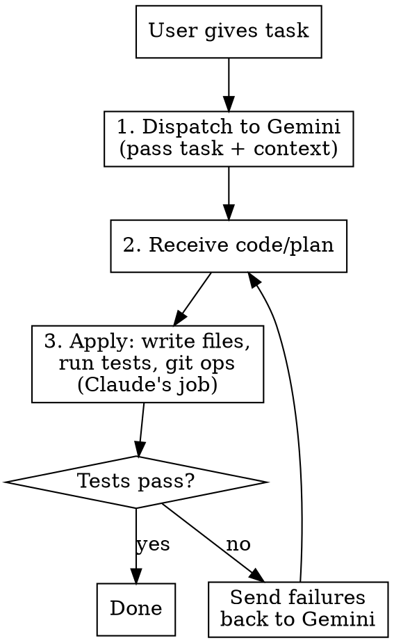

# Tango and Cash

## Overview

Gemini thinks. Claude does.

Gemini is free and unlimited. Claude tokens are expensive. Offload all heavy thinking — planning, code generation, analysis, debugging — to Gemini. Claude handles what Gemini can't: tool use, file writes, git operations, running tests.

**Goal: minimize Claude token spend while staying in Claude Code CLI.**

## When to Use

- Any implementation task (features, bugfixes, tests, refactoring)
- Debugging and root cause analysis
- Code review and design decisions

**Don't use for:** pure git operations, file renames, or tasks where Claude's overhead would exceed just doing it.

## Workflow



**Claude's token budget per task:**
- Build the prompt (~short: task description + file paths)
- Parse output (skim for file boundaries)
- Write files, run tests, git commit
- If failures: forward error output to Gemini

**Gemini's budget (free):** all the thinking, planning, code generation, analysis.

## Dispatching to Gemini

### Standard pattern

```bash
gemini -p "TASK_DESCRIPTION

Relevant files in this project:
- src/routes/users.ts
- src/middleware/auth.ts
- src/types/index.ts

Read them and implement the changes. Output each file with its path." -o text 2>&1
```

Gemini reads files in the working directory. List paths — don't paste contents, don't burn Claude tokens on context.

### For debugging

```bash
gemini -p "These tests are failing:

$(npm test 2>&1 | tail -50)

Relevant source files are in src/. Read them, diagnose the root cause, and output fixed code with file paths." -o text 2>&1
```

### For design/planning

```bash
gemini -p "I need to add [FEATURE] to this project. Read the codebase and propose an implementation plan. List which files to create/modify and what changes to make in each." --approval-mode plan -o text 2>&1
```

### Key flags

| Flag | Use |
|------|-----|
| `-p "..."` | Non-interactive — **always required** |
| `-o text` | Clean output — **always use** |
| `--approval-mode plan` | Read-only (for analysis/planning) |
| `-y --sandbox` | Let Gemini use tools in sandbox |

## Applying Output

Claude's job is **mechanical** — parse Gemini's response, write files, run verification:

1. Extract code blocks and file paths from Gemini's output
2. Write each file using Write/Edit tools
3. Run tests/build/lint
4. If failures: send error output back to Gemini (not Claude analysis — just the raw output)
5. Git add, commit, push

**Do NOT:** re-analyze Gemini's code in detail, rewrite it, or add your own improvements. That burns tokens. If something is wrong, send it back to Gemini.

## Iteration on Failures

```bash
gemini -p "The implementation you suggested has test failures:

$(npm test 2>&1 | tail -80)

The files are already written. Read them in the project and fix the issues. Output only the files that need changes, with their paths." -o text 2>&1
```

Forward raw error output. Don't summarize or analyze — that's Claude tokens wasted on work Gemini can do.

**Max 3 rounds.** If Gemini can't fix it, then Claude intervenes.

## Token Discipline

| Temptation | Instead |
|------------|---------|
| Analyze the codebase before prompting | List file paths, let Gemini read them |
| Design the approach yourself | Ask Gemini for the plan |
| Review Gemini's code in detail | Write it, run tests, let tests be the review |
| Summarize errors for Gemini | Pipe raw output — `$(npm test 2>&1)` |
| Add your own improvements | If it passes tests, ship it |
| Explain what you're doing | Just do it. Less text = fewer tokens. |

## Troubleshooting

| Problem | Fix |
|---------|-----|
| `TerminalQuotaError` | Gemini quota hit — do the work yourself |
| Empty/garbage output | Shorter prompt, fewer files, more specific task |
| Markdown fences in output | Parse around them or add "no markdown fences" |
| Gemini misunderstands project structure | Add `--include-directories .` and list key file paths |
| Gemini suggests wrong patterns | Add "read src/existing-example.ts and follow that pattern" |
