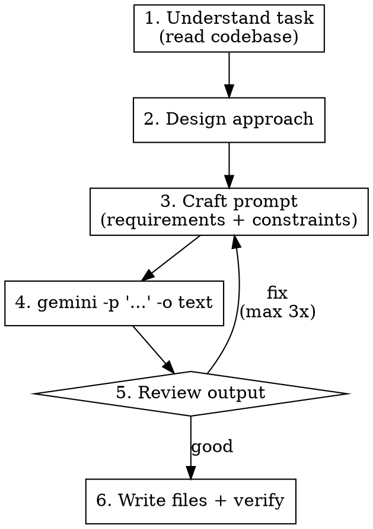

# Tango and Cash

## Overview

Claude architects. Gemini implements. Claude reviews.

You are the senior dev. Gemini CLI is your fast coder. Design the approach, craft precise prompts, review output, iterate until quality is met.

## When to Use

- Multi-file feature implementation
- Generating tests, boilerplate, or scaffolding
- When you want an independent implementation perspective

**Don't use for:** one-line fixes, pure refactoring, or after 3 failed iterations (write it yourself).

## Workflow



## Invoking Gemini CLI

```bash
OUTPUT=$(gemini -p "PROMPT" -o text 2>&1)
```

Gemini reads files in the working directory — reference paths, don't paste contents.

| Flag | Use |
|------|-----|
| `-p "..."` | Non-interactive mode — **always required** |
| `-o text` | Clean text output — **default for code gen** |
| `-y --sandbox` | Auto-approve tools in isolated sandbox |
| `--approval-mode plan` | Read-only analysis, no file modifications |
| `--include-directories DIR` | Add directories to workspace |

## Prompt Template

```
Implement [WHAT] in [WHERE].

Requirements:
1. [Specific, numbered requirement]
2. [Another requirement]

Constraints:
- Language: [e.g., TypeScript strict mode]
- Patterns: [e.g., follow src/routes/health.ts]
- Dependencies: [e.g., stdlib only, no external packages]

Output ONLY the code. No markdown fences. No explanation.
```

**Rules:** One file per prompt. Number requirements. Reference files by path. List forbidden things explicitly.

## Review Checklist

1. **Requirements** — Walk each numbered requirement
2. **Security** — Injection, exposure, missing validation?
3. **Edge cases** — Null, empty, error paths?
4. **Style** — Matches codebase conventions?
5. **Dependencies** — Only approved libraries?

## Iterating

```bash
OUTPUT=$(gemini -p "Revise this code. Changes:
1. [change referencing requirement number]
2. [change]

Code is in [path]. Read it and apply changes.
Output ONLY revised code. No markdown fences." -o text 2>&1)
```

**Max 3 rounds.** Then write it yourself.

## Troubleshooting

| Problem | Fix |
|---------|-----|
| `TerminalQuotaError` | Write code yourself or wait for reset |
| Empty/garbage output | Simplify prompt, reduce scope |
| Markdown fences in output | Add "no markdown fences" to constraints |
| Wrong language/framework | Add explicit constraint: "Use X, NOT Y" |
| Hallucinated imports | Add "Dependencies: ONLY [list]" |
| Vague results | More numbered requirements, less prose |
